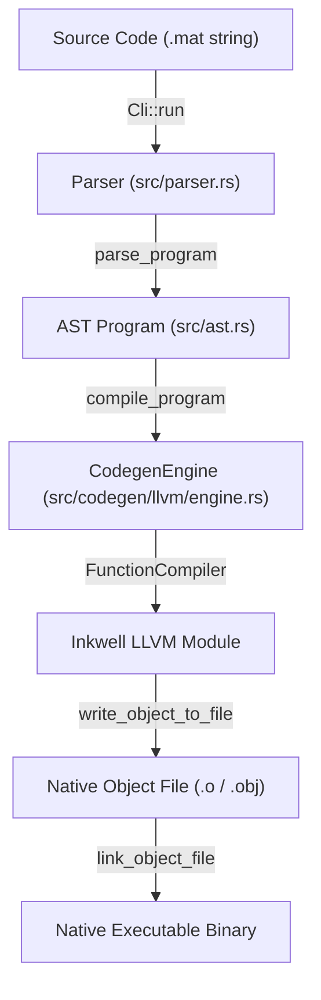
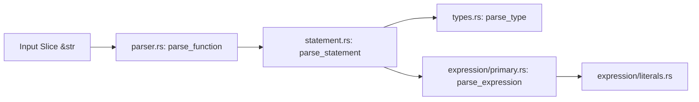
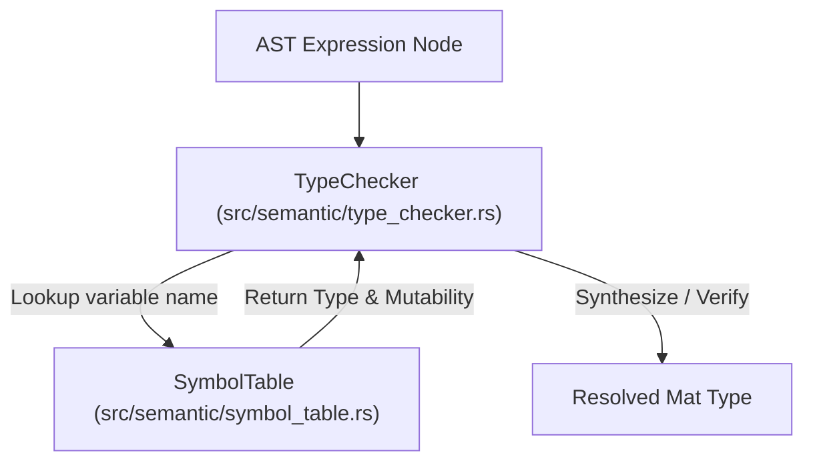
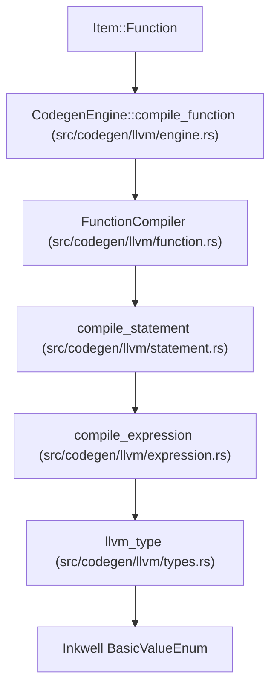
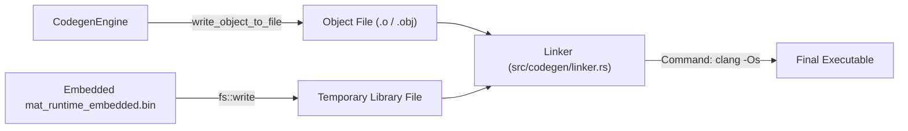

# Mat Compiler Architecture & Dataflow Specification

This document details the end-to-end dataflow and architectural pipeline of the `matc` compiler, tracing how source code transforms from UTF-8 text into parsed Abstract Syntax Trees (AST), type-checked constructs, Inkwell LLVM Intermediate Representation (IR), and linked native executables.

## 1. Top-Level Data Pipeline

The driver workflow operates as follows:

1. **Driver Setup**: [`../src/main.rs`](../src/main.rs) initializes tracing and invokes `Cli::parse()` from [`../src/cli.rs`](../src/cli.rs).
2. **File Loading**: [`../src/cli.rs`](../src/cli.rs) reads the `.mat` file from disk into memory as a `String` slice.
3. **Parsing**: Source text passes into `Parser::new(&source)` in [`../src/parser.rs`](../src/parser.rs) to generate a structural `Program` AST.
4. **LLVM Lowering**: `CodegenEngine` in [`../src/codegen/llvm/engine.rs`](../src/codegen/llvm/engine.rs) iterates through AST items, lowering each declaration into LLVM IR via Inkwell.
5. **Assembly & Object Output**: `CodegenEngine::write_object_to_file` emits a machine-code object file using LLVM native target machines.
6. **Linking**: [`../src/codegen/linker.rs`](../src/codegen/linker.rs) extracts the embedded static runtime library (`mat_runtime`) and delegates final linking to `clang`.

## 2. Parsing & AST Construction

The parsing stage converts unformatted source text into AST nodes using [Winnow](https://docs.rs/winnow) parser combinators.

### Parser Component Breakdown

#### Top-Level Item Parser

- **File**: [`../src/parser.rs`](../src/parser.rs)
- **Components**: `Parser<'a>`, `parse_function`
- **Input**: Source code string slice (`&str`).
- **Operation**:
- Identifies the `fn` keyword, function identifier, argument parenthesis `()`, and body delimited by `{}` using Winnow combinators (`delimited`, `repeat`).

- **Output**: `Result<Program, MatcError>` wrapping a `Vec<Item::Function(FunctionDeclaration)>`.

#### Statement Parser

- **File**: [`../src/parser/statement.rs`](../src/parser/statement.rs)
- **Components**: `parse_statement`, `parse_let_statement`, `parse_assignment_statement`, `parse_increment_statement`, `parse_decrement_statement`, `parse_expression_statement`
- **Input**: Remaining slice of body tokens (`&mut &str`).
- **Operation**:
- `parse_let_statement`: Parses variable definitions (`let mut x: Type = Expr;`). Invokes `parse_type` if explicit annotations exist, and `parse_expression` for initialization values.
- `parse_assignment_statement`: Parses mutable re-assignments (`x = Expr;`).
- `parse_increment_statement` / `parse_decrement_statement`: Handles postfix unary updates (`x++;` / `x--;`).
- `parse_expression_statement`: Parses standalone expressions terminating with semicolons.

- **Output**: `ModalResult<Statement>` mapped to variants in [`../src/ast.rs`](../src/ast.rs).

#### Type Parser

- **File**: [`../src/parser/types.rs`](../src/parser/types.rs)
- **Components**: `parse_type`
- **Input**: Token slice inside variable annotations or return type signatures (`&mut &str`).
- **Operation**:
- Matches base primitive identifiers (`int`, `i32`, `i16`, `i8`, `f64`, `f32`, `bool`, `String`).
- Recursively parses composite types like tuples (`(Type, Type)`) and fixed-size arrays (`[Type; len]`).

- **Output**: `ModalResult<Type>` mapped to [`../src/ast/types.rs`](../src/ast/types.rs).

#### Expression Primary & Postfix Parser

- **File**: [`../src/parser/expression/primary.rs`](../src/parser/expression/primary.rs)
- **Components**: `parse_expression`, `parse_primary_expression`, `parse_identifier`, `parse_tuple_or_parenthesized`, `parse_array_literal`
- **Input**: Token slice (`&mut &str`).
- **Operation**:
- `parse_primary_expression`: Delegates primitive literals, array/tuple literals, and identifiers to `alt(...)`.
- `parse_expression`: Loops over primary expressions to fold postfix operators:
- Function calls: `callee(arg1, arg2)` -> `Expression::Call`
- Tuple field extraction: `expr.0` -> `Expression::TupleAccess`
- Array indexing: `expr[index]` -> `Expression::ArrayAccess`

- **Output**: `ModalResult<Expression>`.

#### Literal & Interpolation Parser

- **File**: [`../src/parser/expression/literals.rs`](../src/parser/expression/literals.rs)
- **Components**: `parse_int_literal`, `parse_float_literal`, `parse_bool_literal`, `parse_string_or_interpolated`
- **Input**: Raw text fragments (`&mut &str`).
- **Operation**:
- `parse_string_or_interpolated`: Iterates through string content bounded by `"`. Detects unescaped `{expr}` blocks, splits textual chunks into `Expression::StringLiteral`, parses embedded blocks as inner `Expression`s, and bundles them into `Expression::InterpolatedString(Vec<Expression>, Span)`.

- **Output**: Primitive `Expression` literal variants with source [`Span`](../src/ast/span.rs) offsets.

## 3. Abstract Syntax Tree Data Models

The AST definitions in [`../src/ast.rs`](../src/ast.rs) and [`../src/ast/types.rs`](../src/ast/types.rs) serve as the shared intermediate representations between the parser, semantic analyzer, and LLVM codegen passes.

| AST Node                | Rust Representation          | Primary Contents                                                                                                                                                       |
| ----------------------- | ---------------------------- | ---------------------------------------------------------------------------------------------------------------------------------------------------------------------- |
| **Program**             | `struct Program`             | `items: Vec<Item>`                                                                                                                                                     |
| **Item**                | `enum Item`                  | `Function(FunctionDeclaration)`                                                                                                                                        |
| **FunctionDeclaration** | `struct FunctionDeclaration` | `name: String`, `return_type: Type`, `body: Vec<Statement>`                                                                                                            |
| **Statement**           | `enum Statement`             | `Let`, `Assignment`, `Increment`, `Decrement`, `Expression`                                                                                                            |
| **Expression**          | `enum Expression`            | `Identifier`, `IntLiteral`, `FloatLiteral`, `BoolLiteral`, `StringLiteral`, `InterpolatedString`, `TupleLiteral`, `ArrayLiteral`, `TupleAccess`, `ArrayAccess`, `Call` |
| **Type**                | `enum Type`                  | `Void`, `Int`, `I32`, `I16`, `I8`, `F64`, `F32`, `Bool`, `String`, `Tuple(Vec<Type>)`, `Array(Box<Type>, usize)`                                                       |

## 4. Semantic Analysis & Type Synthesis

The semantic phase validates variable scopes and resolves types before LLVM IR generation.

- **Symbol Table**: [`../src/semantic/symbol_table.rs`](../src/semantic/symbol_table.rs)
- Maintains map of scope variables to `(Type, is_mutable)`.

- **Type Checker**: [`../src/semantic/type_checker.rs`](../src/semantic/type_checker.rs)
- `synthesize_expr(&self, expr: &Expression, symbols: &SymbolTable) -> Result<Type>`: Derives types from expressions (e.g., array literal elements, identifier lookup, string interpolation yields `Type::String`).
- `check_expr(&self, expr: &Expression, expected: &Type, symbols: &SymbolTable) -> Result<Type>`: Ensures explicit annotations on `let` bindings match synthesized value types.

## 5. Code Generation & LLVM Lowering

Code generation maps Mat AST structures into LLVM IR instructions via [Inkwell](https://github.com/TheOConcept/inkwell).

### Submodule Breakdown

#### LLVM Engine & Entry

- **File**: [`../src/codegen/llvm/engine.rs`](../src/codegen/llvm/engine.rs)
- **Components**: `CodegenEngine<'ctx>`
- **Data Held**: Inkwell `Context`, `Module<'ctx>`, `Builder<'ctx>`.
- **Operation**:

1. `CodegenEngine::new`: Initializes module and invokes `declare_runtime_symbols` ([`../src/codegen/runtime.rs`](../src/codegen/runtime.rs)) to register C runtime bindings (`_mat_rt_init`, `_mat_rt_println_int`, etc.).
2. `compile_program`: Iterates through items and creates an entry `BasicBlock` for each function.
3. Inserts runtime setup calls (`_mat_rt_init`) when compiling `main`.
4. Delegates function body translation to `FunctionCompiler`.

#### Function Context & Scope Compilation

- **File**: [`../src/codegen/llvm/function.rs`](../src/codegen/llvm/function.rs)
- **Components**: `FunctionCompiler<'a, 'ctx>`
- **Data Held**:
- Reference to parent `&CodegenEngine<'ctx>`.
- Active LLVM `FunctionValue<'ctx>`.
- `local_vars`: HashMap mapping variable identifiers to `(PointerValue<'ctx>, Type)`.
- Per-function `SymbolTable` and `TypeChecker`.

#### Statement Lowering

- **File**: [`../src/codegen/llvm/statement.rs`](../src/codegen/llvm/statement.rs)
- **Components**: `FunctionCompiler::compile_statement`
- **Operation**:
- `Statement::Let`: Synthesizes value type, emits stack allocation instruction (`build_alloca`), compiles initialization expression, and emits `build_store` to write value into the allocated pointer. Registers pointer in `local_vars`.
- `Statement::Assignment`: Evaluates expression and updates allocated memory via `build_store`.
- `Statement::Increment` / `Statement::Decrement`: Loads existing pointer value (`build_load`), computes integer addition or subtraction, and stores result back.

#### Expression Lowering

- **File**: [`../src/codegen/llvm/expression.rs`](../src/codegen/llvm/expression.rs)
- **Components**: `FunctionCompiler::compile_expression`
- **Operation**:
- **Literals**: Emits LLVM constants (`const_int`, `const_float`, `build_global_string_ptr`).
- **Identifiers**: Looks up stack `PointerValue` from `local_vars` and emits `build_load`.
- **Tuples & Arrays**: Emits temporary stack `build_alloca`, calculates field or index pointers via GEP (`build_struct_gep` / `build_gep`), stores elements, and returns loaded structure values.
- **Interpolated Strings**: Formats parts into a C printf-style format string (`%lld`, `%s`, `%g`), constructs dynamic pointer arguments, and emits a call to runtime function `_mat_rt_fmt_string`.
- **Built-in Calls**: Translates `println(val)` to specialized C runtime functions (`_mat_rt_println_str`, `_mat_rt_println_int`, etc.) based on expression type bitwidth and variant.

#### LLVM Type Lowering

- **File**: [`../src/codegen/llvm/types.rs`](../src/codegen/llvm/types.rs)
- **Components**: `CodegenEngine::llvm_type`
- **Operation**:
- Maps Mat [`Type`](../src/ast/types.rs) variants to Inkwell `BasicTypeEnum<'ctx>`:
- `Type::Int` -> `context.i64_type()`
- `Type::String` -> `context.ptr_type(...)`
- `Type::Tuple(elems)` -> `context.struct_type(...)`
- `Type::Array(elem, len)` -> `elem_llvm.array_type(len)`

#### Helper Codegen Utilities

- **Symbol Mangling**: [`../src/codegen/mangling.rs`](../src/codegen/mangling.rs) (`mangle_symbol`) ensures functions get exported with C ABI naming rules (e.g., `main` remains `main`, user routines become `_mat_<name>`).
- **Runtime Declarations**: [`../src/codegen/runtime.rs`](../src/codegen/runtime.rs) (`declare_runtime_symbols`) registers function signatures for external C helpers implemented in [`../runtime/mat_runtime.c`](../runtime/mat_runtime.c).

## 6. Linking & Executable Generation

Once LLVM IR lowering finishes, native binary generation proceeds:

1. **Native Object Generation**: `write_native_file` in [`../src/codegen/llvm/engine.rs`](../src/codegen/llvm/engine.rs) initializes native target targets, constructs an LLVM `TargetMachine`, and compiles the LLVM module into an object file.
2. **Runtime Unpacking**: [`../src/codegen/linker.rs`](../src/codegen/linker.rs) unpacks embedded static runtime library bytes (`mat_runtime_embedded.bin`, compiled from `runtime/mat_runtime.c` during build) to a temporary library file (`mat_runtime.a` / `mat_runtime.lib`).
3. **Linker Dispatch**: `link_object_file` constructs a platform-specific `clang` command:

- **Windows**: Passes MSVC library paths found via `vswhere.exe` or environment variables, using `lld-link`, `user32.lib`, and `advapi32.lib`.
- **macOS / Linux**: Appends `-lpthread`, `-ldl`, and linker optimization flags (`-Wl,--gc-sections` or `-Wl,-dead_strip`).

4. **Cleanup**: Removes temporary runtime artifacts upon link completion and produces the executable binary.
